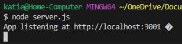

# NoteTaker_Express.js

## Description

Replace your paper and pen with this easy-to-use Note Taker!

## Table of Contents

- [Installation](#installation)
- [Initiate](#initiate)
- [Credits](#credits)

## Installation

Node.js - express @4.18.2 and uuid @9.0.1 required.

## Initiate
START THE APPLICATION
1. Use the command line to invoke the application. Then cntrl+click the link.

     Use **node server.js** OR **nodemon server.js**

    

2. Checkout the live link through Heroku: [NoteTaker](https://doughertynotetaker-47cec6e32b0a.herokuapp.com/)

## How-To-Use

✅ To begin, type the name of your note and details in the main prompt.

Save the note by clicking the button in the top right corner OR you could Clear Form and start over. 

All saved notes will be seen in the left column by title. To see the details, simply click the note.

To delete a note, simply click the red trashcan! Warning: you cannot retrieve deleted notes.

Checkout this VSCode walkthrough video if you have any questions: [Walkthrough](https://drive.google.com/file/d/1A1MfwvbUihhj2-8l4YW4eWqCWHnrQjF9/view)

## Credits

Project created by Kathryn Dougherty with instruction from the UCF Coding Bootcamp.
Special Thanks to Dru for review. 

